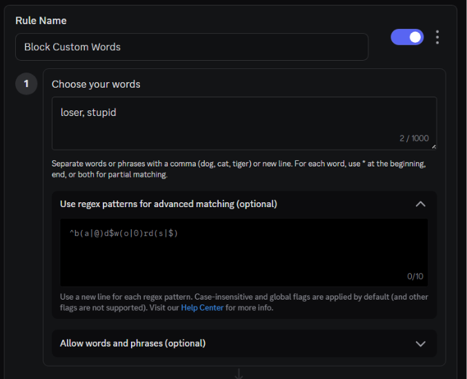
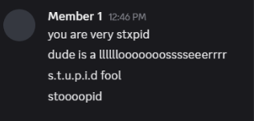
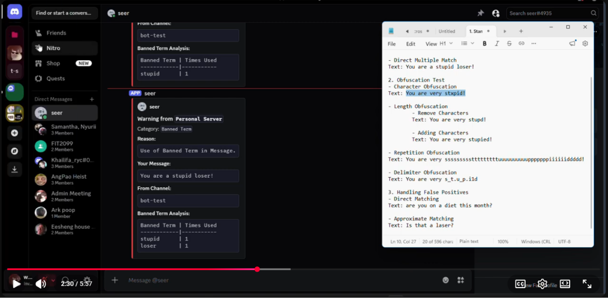
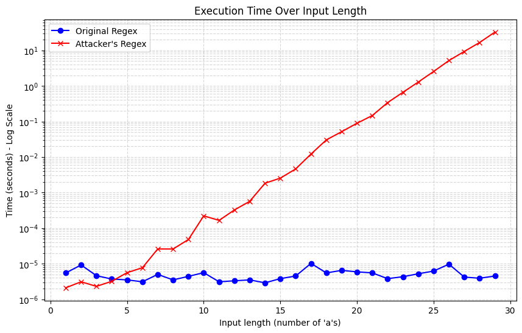
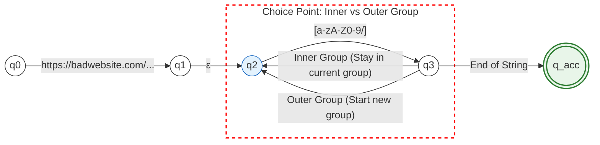
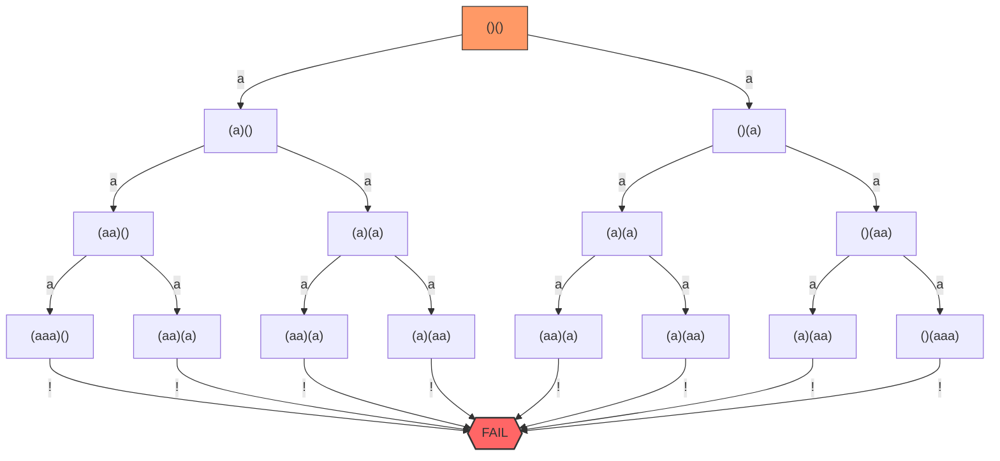
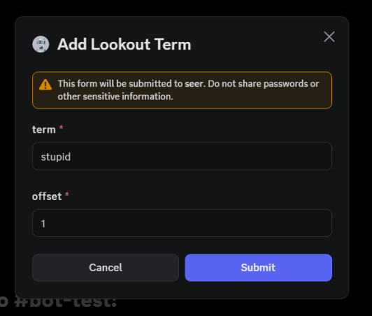
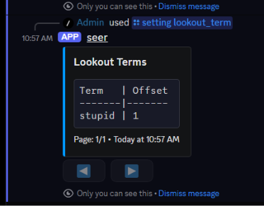
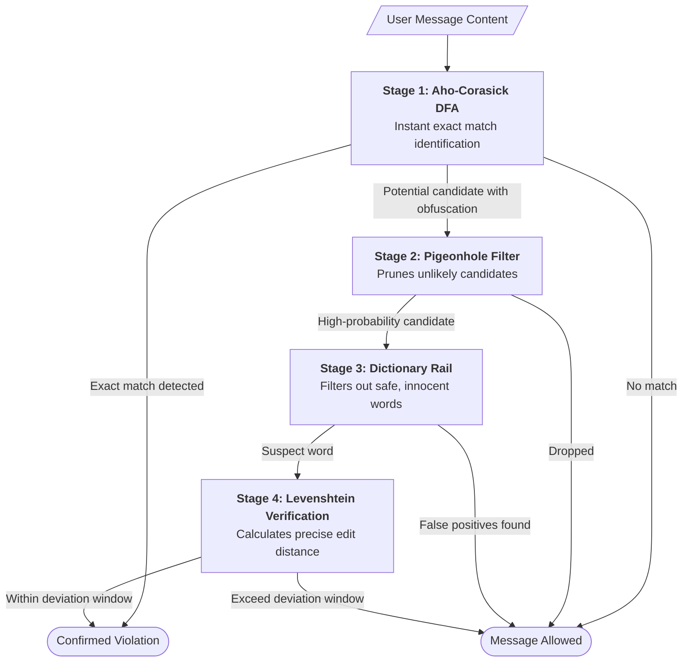
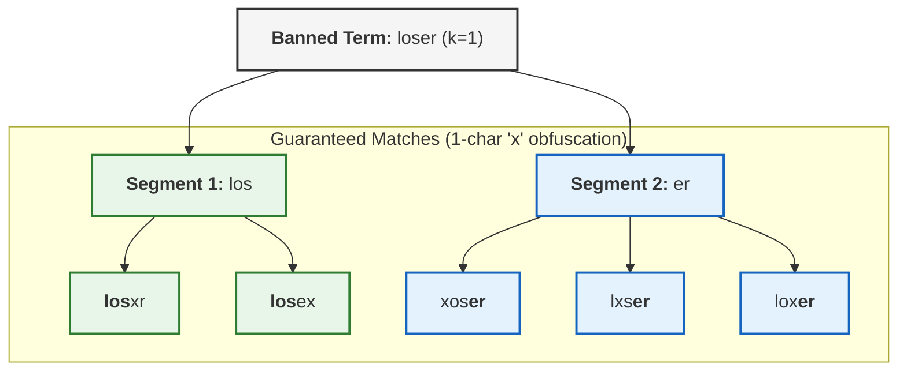

# Seer: Simplifying Moderation

## Background

Managing a growing Discord community is demanding, and your moderation tools shouldn't make it harder. Most bots require administrators to learn complex Regular Expressions or manually maintain endless lists of word variations just to stop bypass attempts like `b.a.d.w.o.r.d`. This forces human moderators to constantly play catch-up with bad actors.

## Problem Statement 

Existing moderation bots requires complex configuration to simulate versatility.

**Discord's Native Solution: AutoMod Configuration Panel**



Take Discord's native moderation solution for an example, configuring and catching exact matches like "stupid" and "loser" is straightforward. What happens when users start adding obfuscation to the term?

**Example of Obfuscation**


To handle these obfuscated text messages with the existing solution, moderators have to create complex regular expressions or manually list out all combinations of the obfuscation.

On top of that, we cannot guaratee that the constructed regular expression is safe and comprehensive enough to cover different types of obfuscation without resulting in false postives.

Seer resolves those problems by abstracting complex versatility handling to the algorithm itself and allowing moderators to configure using layman rules.

## Demonstration

[](https://www.youtube.com/watch?v=mAT379q3io8)

## Problem Analysis

### The Moderation Landscape

Before diving into Seer's architecture, it’s worth looking at how most Discord bots currently handle moderation.

| Bot / Solution | Approach | Usage |
| :--- | :--- | :--- |
| **Red-DiscordBot** | Python Regex (NFA) | ~5,500 GitHub Stars |
| **Discord AutoMod** | Rust Regex (DFA) | Native (Millions) |
| **YAGPDB** | Go Regex (DFA) | 3.5M+ Servers |
| **Conventional Algorithms** | Boyer-Moore, `String.includes()` | Most common |

Most existing solutions rely on either conventional pattern matching algorithms—which don't scale—or complex regular expressions that can be difficult to manage and potentially dangerous to the bot's stability.

### Why Scaling Moderation is Difficult

Developing a filter for a few dozen words is straightforward, but performance and security issues emerge quickly as a server grows.

#### The Limits of Conventional Pattern Matching
The most common approach in moderation bots is to check a message against a list of words using conventional pattern matching techniques. Even when these algorithms are optimized, they face a fundamental scalability barrier.

*   **The Brute-Force Approach:** Many bots use standard library functions like `String.includes()`. In a multi-rule scenario, this is a conventional approach ($O(T \times P)$) where the engine effectively re-scans the message for every single banned term.
*   **Optimized Matching (e.g., Boyer-Moore):** More sophisticated bots might use algorithms like Boyer-Moore. While this is significantly faster for finding a single word ($O(T + P_i)$), it still requires the bot to re-process the entire message from scratch for every pattern in the ruleset. 

If you have a thousand banned terms, the bot is still making a thousand independent passes over the text. As the ruleset expands, the overhead grows linearly, creating a significant bottleneck during high-traffic periods.

---

#### Solving Multi-Pattern Matching with Finite Automata
To break through this scaling limit, high-performance engines use the **Finite Automaton** model. Instead of looping through rules one by one, a Finite Automaton merges all your patterns into a single, graph-like structure (a state machine). 

When a message is scanned, the machine follows the paths in this graph. This allows the bot to identify *every* match in the message simultaneously in one pass, rather than re-reading the message for every word. 

However, the safety and performance of this approach depend entirely on how the state machine is designed. There are two primary paths: **NFA** and **DFA**.

##### The NFA Approach
**Red-DiscordBot** uses an **NFA (Non-deterministic Finite Automaton)** engine. NFAs are highly flexible, but they achieve this by allowing "choices" at each step. When an NFA hits a complex rule, it assumes a path; if that path doesn't lead to a match, it goes back and tries another.

This process is called backtracking. A bad actor can exploit this by sending a "trap" message that forces the engine to explore all possible combinations in a complex regex. This is known as a **ReDoS (Regular Expression Denial of Service)** attack.

##### Exploiting the NFA Model
Imagine a moderator who needs to protect their community from a specific malicious domain. They create a straightforward rule to identify and block any links pointing to `badwebsite.com`:

* Original Regex: `https://badwebsite\.com/([a-zA-Z0-9/]+)`

The rule is simple, effective, and works without issue. However, a bad actor identifies this rule and suggests a "minor optimization" to make the matching more flexible by adding a single `+` character:

* Attacker's Regex: `https://badwebsite\.com/([a-zA-Z0-9/]+)+`

Now let's benchmark the execution time of each regex over the same text.

```python
def sampleBenchmarkFunction(regex, n):
    # the last character "!" is intentionally used to cause a non-match which enables back-tracking
    test_string = "https://badwebsite.com/" + ("a" * n) + "!"
    
    start = time.perf_counter()
    regex.search(test_string)
    end = time.perf_counter()
    
    return end - start
```

**The Result**



While the original regex had constant performance across small increasing intervals of input length. The attacker's regex resulted in an exponential increase of execution time, **taking over 30 seconds to validate a ~30 character length text**.





This is an example of **catastrophic backtracking**. The attacker's regex creates a nested quantifier (a `+` inside a `+`). When the engine fails to find a match, it tries every possible mathematical combination of the string.

##### The DFA Approach

State-of-the-art solutions like **YAGPDB** and Discord's native **auto-mod** uses a **DFA (Deterministic Finite 
Automaton)**. 

**Is it immune to ReDoS?**

It isn't, the difference is that the effect takes place at a safer stage (before runtime / during state machine construction), allowing engines to detect before an attack can transpire.

**Why is this detection possible?**

DFAs are designed with the principle where each state must have unique transitions. Therefore, backtracking is not possible. However, this limitation results in a more complex state machine especially when the defined regex is very complex.

---
 
#### The Human Barrier

Beyond performance, regex is notoriously difficult to write and maintain. Expecting moderators to craft complex patterns to catch evasions (like `a.p.p.l.e`) is unrealistic and error-prone. A single typo can lead to false positives or missed violations. We believe moderation tools should be powerful by default, without requiring users to write code.

## Proposed Solution

### Configure Banned Terms

- Execute seer's add-lookout-term command.


- A popup modal will inquire for a banned term and the acceptable deviation for that term.



- Execute seer's show-lookout-term command.


- An interactive tabular message will show the configured banned terms for the server.



### Handling Banned Terms


[](https://www.youtube.com/watch?v=mAT379q3io8)

## How it Works

The challenge of modern community moderation lies in the tension between versatility—catching clever obfuscations—and performance—maintaining sub-millisecond response times on high-volume servers. Seer resolves this conflict through a multi-stage pipeline designed to prune noise and validate intent with surgical precision.



### Stage 1: Aho-Corasick DFA

To achieve true scalability, Seer moves away from traditional, backtracking-heavy regular expressions which are inherently vulnerable to Regular Expression Denial of Service (ReDoS) attacks. Instead, the engine utilizes a custom implementation of the **Aho-Corasick algorithm** to simulate a Deterministic Finite Automaton (DFA). This approach guarantees $O(N)$ time complexity, where $N$ is the length of the message, regardless of the number of banned terms. By merging all banned terms into a single, unified trie-based state machine, Seer can simulataneously identify banned term matches in a single pass. Most importantly, this custom DFA implementation is the foundation to the efficient-versatility implementation for the following stages.

### Stage 2: Pigeonhole Filter

To enable versatility in our pattern matching, we need to integrate some form of approximate matching which are more computationally expensive in contrast to exact matching. Standard algorithms like Levenshtein distance require $O(m \times n)$ operations; executing such checks globally across every message against a series of patterns can lead to significant latency. To mitigate this, Seer employs the **Pigeonhole Principle** as a filtering heuristic to prune the search space.

The pigeonhole theorem states that if we allow a maximum edit distance of $k$, and partition a pattern into $k+1$ segments, then any approximate match within that distance *must* contain at least one segment that matches the original pattern exactly. This allows Seer to avoid expensive approximate matching for the majority of the message content;  reserving computation only for high potential candidates/segments identified from Stage 1.



### Stage 3: Dictionary Rail

Naive filters often suffer from the **"Scunthorpe Problem"**—flagging innocent words that contain prohibited substrings (e.g., "accumulation" or "therapist"). These false positives disrupt natural conversation and undermine filter reliability.

Seer’s **Dictionary Rail** resolves this by cross-referencing candidates against token boundaries and a linguistic database. Before final verification, the engine performs:

1.  **Linguistic Validation:** Checks if the match is part of a recognized safe word (e.g., "diet" vs. "die").
2.  **Boundary Analysis:** Determines if the candidate is a standalone token or embedded in a larger, innocent term.

This contextual layer ensures Seer surgically isolates genuine obfuscations while allowing natural, legitimate language to pass uninterrupted.

### Stage 4: Levenshtein Verification

The final phase of the pipeline provides the definitive verdict. While previous stages prune the search space and validate context, **Levenshtein Edit Distance** provides a mathematically rigorous confirmation of the match's similarity.

Because Stages 1 through 3 have already surgically isolated a narrow window of suspicious text, Seer can execute this $O(m \times n)$ calculation with negligible performance impact. By determining the exact number of character insertions, deletions or substitutions required to transform the candidate into a prohibited term, the engine makes a precise "Yes/No" determination. This ensures that moderation actions are only taken when a violation is mathematically confirmed within the user-defined deviation threshold.
